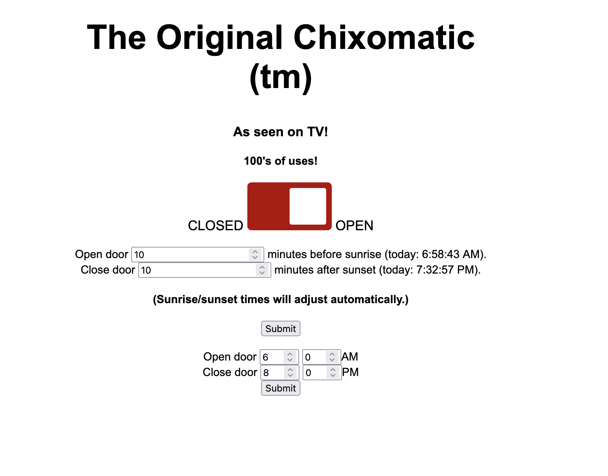

## Automatic Chicken Coop Door Controller

Uses [this](https://www.amazon.com/dp/B0D3PRV82J) coop door.

I removed the controller and replaced it with an [Adafruit Reverse TFT Feather](https://learn.adafruit.com/esp32-s2-reverse-tft-feather/overview)

That specific door is no longer available on Amazon but there are other similarly inexpensive ones in stock. The door used 3 AAA batteries so it runs on 4.5VDC, and works fine on 5VDC from USB.

The Adafruit ESP32 controls a TB6612 motor driver to open and close the door. 
The door has a simple reed switch, connected to a GPIO. When the switch engages, it triggers an interrupt.
The code relies on the [ReactESP](https://github.com/mairas/ReactESP) library, which provides an easy way to deal with interrupts: I create a reaction function that moves the door motor, and simply delete the "open" or "close" reaction function when the switch interrupt is triggered. (I learned the hard way that it's important to keep an interrupt service routine, or ISR, as short as possible or you can delay essential system functions and crash the ESP32).

I also included three pushbuttons, to manually open, close, and reset the ESP32.

The system is connected to wifi, and it pings a geolocation server to find its approximate location (latitude/longitude) based on its IP address. Then it queries a service that supplies sunrise/sunset data. The primary motivation for this project was to protect the chickens from predators, which means adjusting the door open/close times throughout the year so the door opens approximately at dawn and closes shortly after dusk. It's not a problem if the door opens later than dawn, since the chickens can just stay in the coop, but if the door closes too early, they can be trapped outside and easy prey for raccoons, but if it closes too late, rats get into the coop at night and eat their food and spread disease.

Many thanks to the fine people at [Random Nerd Tutorials](https://randomnerdtutorials.com/esp32-dc-motor-l298n-motor-driver-control-speed-direction/). Almost all of my ESP32 projects have some of their code. Their tutorials are the best way to learn microcontrollers as a hobby.

I'm also using @mathieucarbou's async TCP and web server libraries, as well as @ayusharma82's Elegant OTA and WebSerial libraries for updates and monitoring of the system. They make it easier to debug a microcontroller that's out in the back yard.

There is, of course, an animated image of a chicken because, why not?

<video width="640" height="360" controls>
  <source src="chixomatic.mp4" type="video/mp4">
  Your browser does not support the video tag.
</video>

My door included some thin transparent washers between the motor mechanism and the sliding door, which I lost :angry: 
That's why it stutters in the video.